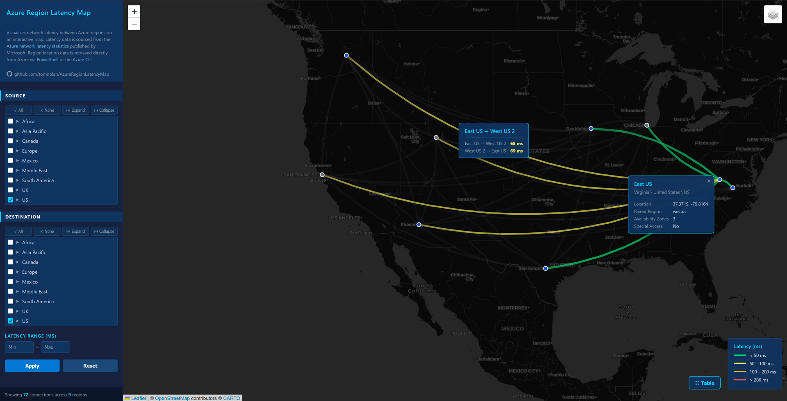

# Azure Region Latency Map

Live version: https://azlatencymap.tinyint.com

This is an interactive map visualizing network latency between Azure regions worldwide — and a fun experiment in building a real project almost entirely through conversation with GitHub Copilot in VS Code.



---

## The Backstory

This project started as an excuse to properly kick the tires on VS Code's AI chat and agent capabilities. Rather than a toy "hello world" exercise, I wanted to build something genuinely useful — something with real data, real UI decisions, and enough complexity to stress-test what AI-assisted development actually feels like day-to-day.

The subject matter picked itself: Azure publishes a public table of inter-region network latency that's surprisingly hard to visualize at a glance. A map seemed like the obvious answer.

What followed was a back-and-forth conversation with GitHub Copilot that produced the entire codebase — HTML, CSS, JavaScript, data wrangling, interaction design, and all. It was less "AI writes the code, I review it" and more like pair programming with someone who can type very fast and never gets tired. Highly recommend the experience.

---

## The Azure Maps Detour

The first version used the **Azure Maps SDK** — a natural choice given the subject matter. It worked beautifully. But Azure Maps requires a subscription key, and embedding that key in a public GitHub repo is obviously a non-starter (the one I used in testing has been rotated out). More importantly, even with a key managed properly, the cost model for a publicly hosted map makes it impractical for a personal project with unpredictable traffic.

So the project was ported to **[Leaflet](https://leafletjs.com/)** with **[OpenStreetMap](https://www.openstreetmap.org/)** and **[CARTO](https://carto.com/)** tile layers — all free, no key required. The Azure Maps version still lives in the `/AzureMaps` folder if you want to run it locally with your own key (you'll be prompted on first load).

---

## The Map

The live version is `index.html` at the root of the project. Open it via a local web server (VS Code's Live Server extension works great) and you'll get an interactive map with all Azure regions plotted and the latency connections between them drawn as curved lines.

If you want to try the Azure Maps version, you can go to `/AzureMaps/index.html`, but you will need to enter your own Azure Maps API key. If you don't have one, just head over to the Azure portal, create an Azure Maps resource, and then grab your key.

### Features

**Latency connections**
Each connection between two regions is drawn as a curved arc colored by latency tier:
- 🟢 Green — under 50 ms
- 🟡 Yellow — 50–100 ms
- 🟠 Orange — 100–200 ms
- 🔴 Red — over 200 ms

Line thickness also scales with latency — faster connections are drawn thicker.

**Filter pane**
The left-hand panel lets you filter what's shown on the map:
- **Source / Destination trees** — hierarchical region pickers organized by geography group and geography. Check individual regions, whole geographies, or entire groups. Mix and match source and destination independently.
- **Latency range** — filter to only show connections within a specific ms range.
- **Apply / Reset** buttons to control when filters take effect.

**Selection and highlighting**
- Click a connection arc to pin it — it stays highlighted and a tooltip shows the latency in both directions. Everything else dims.
- Click a region dot to pin it — all connections to/from that region stay highlighted, everything else dims. A tooltip shows region details.
- Both can be active simultaneously as long as the selected path connects to the selected region.
- Click the × on a pinned tooltip to deselect. Click the map background to clear everything.

**Tooltips**
- Hover over a connection to see source, destination, and latency in both directions.
- Hover over a region dot to see its name, geography, paired region, availability zone count, and coordinates.
- Pinned tooltips track the map as you pan and zoom — they stay geo-anchored to their subject.
- Pinned tooltips are **draggable** — click and drag them to reposition without losing the selection.

**Table view**
The **Table** button opens a pivot matrix of all currently filtered connections, with latency values color-coded by tier. A **Copy Data** button in the table header copies the matrix as CSV to the clipboard. If no regions are selected the modal shows a prompt to apply filters first.

**Data info**
The **ⓘ** button (next to the Table button) shows where the data comes from, including the latency dataset date and when each data file was last retrieved.

**Region markers**
- Blue dot — region with 3 or more availability zones
- Grey dot — region with fewer than 3 availability zones
- Red dashed outline — Restricted Access region

**Basemap selector**
The layer control (top-right corner of the map) lets you switch between:
- **Dark Matter** (default) — CARTO dark style
- **OpenStreetMap** — standard OSM
- **Voyager** — CARTO light/colorful style
- **Positron** — CARTO minimal light style

---

## The Data

**Latency** — `Data/latency.csv`
Sourced from the [Azure network latency statistics](https://learn.microsoft.com/en-us/azure/networking/azure-network-latency) page published by Microsoft. The table covers round-trip latency between region pairs measured over a rolling 30-day window.

**Region metadata** — `Data/regions.json`
Retrieved from the Azure CLI via `az account list-locations`, which returns coordinates, geography group, geography, physical location, paired region, and availability zone mappings. The data is stored as JSON (the format returned by the CLI) rather than CSV.

**Restricted Access status**
The CLI does not expose whether a region requires special access approval. This flag is sourced separately by scraping the [Azure regions list](https://learn.microsoft.com/en-us/azure/reliability/regions-list) page on Microsoft Learn, which marks restricted-access regions with a dedicated icon in its table.

**Last updated** — `Data/lastUpdated.json`
Written by the data refresh scripts. Records when each data file was last retrieved and what dataset date the latency article reported. Shown in the ⓘ info modal.

---

## Refreshing the Data

Three PowerShell scripts in `Scripts/` handle data retrieval. They have no external PowerShell module dependencies beyond the Azure CLI.

### Prerequisites

- **Azure CLI** installed and authenticated (`az login`) — required by `Get-RegionsData.ps1` only.
- PowerShell 5.1+ or PowerShell 7+.
- Internet access to reach `raw.githubusercontent.com`.

### Scripts

**`Scripts/Update-Data.ps1`** *(recommended)*
Runs both scripts in sequence and writes a summary.

```powershell
cd c:\localdev\AzureRegionLatencyMap
.\Scripts\Update-Data.ps1
```

Output files written:
- `Data/regions.json`
- `Data/latency.csv`
- `Data/lastUpdated.json`

---

**`Scripts/Get-RegionsData.ps1`**
Fetches region metadata from the Azure CLI and annotates each entry with the `RestrictedAccessRegion` boolean from the Microsoft docs.

```powershell
.\Scripts\Get-RegionsData.ps1
# Or write to a custom path:
.\Scripts\Get-RegionsData.ps1 -OutputPath .\Data\regions.json
```

Requires `az login` before running.

---

**`Scripts\Get-LatencyData.ps1`**
Downloads the latency markdown article from the MicrosoftDocs GitHub repository and extracts the embedded CSV block.

```powershell
.\Scripts\Get-LatencyData.ps1
# Show row/column counts after extraction:
.\Scripts\Get-LatencyData.ps1 -ShowStats
# Or write to a custom path:
.\Scripts\Get-LatencyData.ps1 -OutputPath .\Data\latency.csv
```

Does **not** require Azure authentication.

---

## Running It

The map loads data via `fetch()` from the `Data/` folder, so it needs to be served over HTTP — opening `index.html` directly as a file won't work.

The easiest option is the [Live Server](https://marketplace.visualstudio.com/items?itemName=ritwickdey.LiveServer) extension for VS Code. Right-click `index.html` → **Open with Live Server**.

Alternatively: `python -m http.server` from the project root, then open `http://localhost:8000`.

---

## Attributions

- **[Leaflet](https://leafletjs.com/)** — © 2010–present, Vladimir Agafonkin. BSD 2-Clause License.
- **[OpenStreetMap](https://www.openstreetmap.org/)** — © OpenStreetMap contributors. [ODbL License](https://www.openstreetmap.org/copyright).
- **[CARTO](https://carto.com/attributions)** — Dark Matter, Voyager, and Positron tile styles.
- **[Azure Network Latency Statistics](https://learn.microsoft.com/en-us/azure/networking/azure-network-latency)** — © Microsoft.
